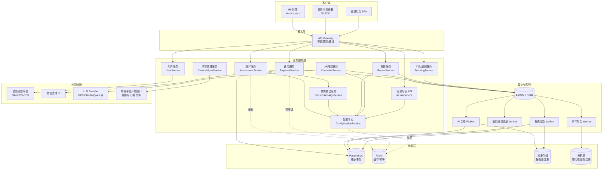
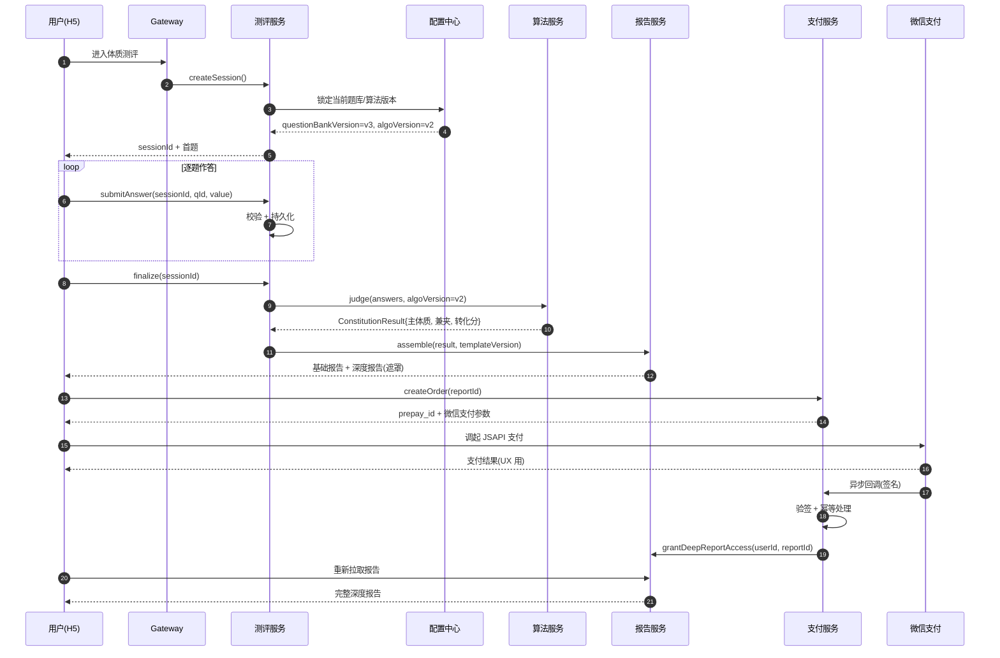
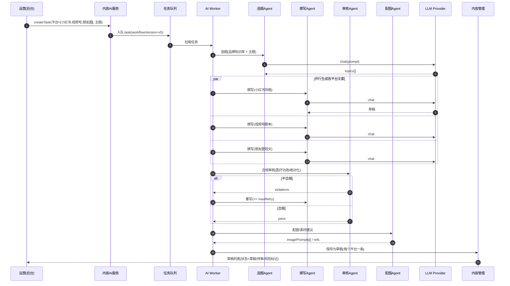
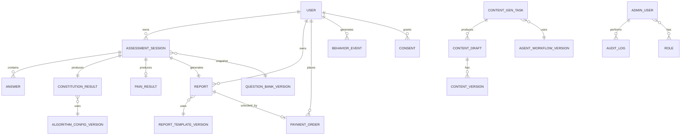

# Design Document

> 知体（tizhice.cn）中医体质健康测评平台 —— 技术设计

## Overview

本设计文档基于已确认的需求文档（`requirements.md`，共 12 项需求），为"知体"H5 平台提供端到端的技术蓝图，覆盖：

- 双通道测评（痛症 + 体质）的引擎与算法
- 动态深度报告（免费 / 付费）生成与分发
- 微信支付（JSAPI）订单与权限闭环
- AI 多 Agent 内容生成与合规审核
- 内容管理、发布与效果追踪
- 用户账户、数据追踪与运营看板
- 管理后台与配置版本化（保证算法/题库/模板的可迭代性与历史可复现性）
- 安全、性能、合规（PIPL）等非功能性约束

### 1.1 设计取舍与默认技术栈（假设）

由于业务定位为**微信内 H5 优先 + 长期可迭代**，本文档采用以下务实默认栈作为设计前提；若后续团队决定替换，组件边界可保持不变：

| 层 | 默认选择 | 备选 / 说明 |
|------|----------|------|
| H5 前端 | Vue 3 + Vite + TypeScript + Pinia + Vant/自研组件 | 微信 JS-SDK 接入分享/授权；移动优先，桌面响应式降级 |
| 后端 | Node.js + NestJS + TypeScript（模块化单体起步，按需拆服务） | 备选 Spring Boot；当前规模不上 K8s 也可，单实例 + 水平扩展 |
| 数据库 | PostgreSQL（核心事务） + Redis（缓存/幂等/限流/会话快照） | JSONB 字段承载题库/模板/配置 |
| 对象存储 | 腾讯云 COS / 阿里云 OSS | 报告图片、素材资源 |
| 支付 | 微信支付 JSAPI（API v3） | 服务端签名校验回调 |
| AI 编排 | 自研轻量 Agent 编排器（DAG/有向工作流） + LLM Provider 抽象层 | 模型可插拔（GPT/Claude/Qwen/DeepSeek） |
| 任务/队列 | BullMQ on Redis | AI 生成、报告生成、回调重放等异步任务 |
| 日志/监控 | OpenTelemetry + ELK/Loki + Sentry | 关键链路埋点与告警 |
| 运营看板 | 后台内嵌图表（ECharts），底层走聚合 SQL / 物化视图 | 数据规模未爆炸前不引入数仓 |

> 说明：以上栈是**假设**；本设计的接口与数据模型不依赖具体实现语言，可在评审阶段调整。

### 1.2 关键设计决策（Architecture Decisions）

| ID | 决策 | 理由 | 影响的需求 |
|----|------|------|------------|
| ADR-1 | 题库、算法阈值、报告模板、Agent 工作流均**配置化 + 版本化** | 长期迭代不改代码；历史报告可复现 | R4, R5, R7, R11 |
| ADR-2 | **配置快照**机制：测评会话开始时锁定题库版本与算法版本，提交时使用快照 | 避免中途切换导致结果不一致 | R4.8, R11.7 |
| ADR-3 | 支付以**服务端回调**为唯一权威态，前端结果仅作 UX 参考 | 防伪造、防客户端篡改 | R6.4, R6.5, R12.4 |
| ADR-4 | **匿名先行 + 登录归并**：用户可匿名作答，登录时把匿名记录归并 | 降低首次测评门槛 | R9.3 |
| ADR-5 | AI 生成结果**必须经过合规审核 Agent + 人工确认**才能发布 | 健康类内容合规风险高 | R7.6, R7.7, R8.7, R12.9 |
| ADR-6 | 健康相关字段**应用层加密**（AES-GCM + KMS 主密钥），DB 仅存密文 | 满足 PIPL 对敏感信息的存储要求 | R9.6, R12.1, R12.6 |
| ADR-7 | 关键服务（测评提交、支付、AI）采用**幂等键 + 异步队列 + 有限重试** | 单点故障不影响整体；防重复扣费/重复生成 | R6.4, R7.11, R12.8 |
| ADR-8 | 报告组装采用**模板 + 内容片段**而非整段硬编码 | 运营可独立维护差异化文案 | R5.6, R11.4 |

## Architecture

### 2.1 系统总体架构



### 2.2 测评 → 报告 → 付费 关键时序



### 2.3 AI 多 Agent 内容生成时序




## Components and Interfaces

各组件接口以 TypeScript 风格签名描述，实现语言无关。所有 API 默认走 Gateway 鉴权，敏感字段在传输与存储均加密（详见第 8 节）。

### 3.1 测评服务（AssessmentService）—— 对应 R1, R2, R3

职责：双通道测评的会话生命周期管理（创建、答题、暂存、恢复、提交），痛症"红旗征"识别。

```ts
type AssessmentChannel = 'PAIN' | 'CONSTITUTION';
type SessionStatus = 'IN_PROGRESS' | 'SUBMITTED' | 'ABANDONED';

interface AssessmentSession {
  id: string;                       // UUID
  userId: string | null;            // 匿名时为 null，登录后归并
  anonymousId: string | null;       // 设备/匿名标识
  channel: AssessmentChannel;
  questionBankVersion: string;      // 快照：开始时锁定（ADR-2）
  algorithmVersion: string;         // 体质通道才有
  baseProfile?: { gender: 'M'|'F'|'OTHER'; ageBand: string };
  status: SessionStatus;
  startedAt: Date;
  submittedAt?: Date;
  resumeQuestionId?: string;        // 中断时定位
}

interface AssessmentService {
  createSession(input: {
    userId?: string;
    anonymousId?: string;
    channel: AssessmentChannel;
    baseProfile?: { gender; ageBand };
    channelSource?: string;         // UTM/渠道码（R10.4）
  }): Promise<{ sessionId: string; firstQuestion: Question }>;

  getNextQuestion(sessionId: string): Promise<Question | null>;
  getResume(userId: string, channel: AssessmentChannel): Promise<AssessmentSession | null>; // R1.4

  submitAnswer(input: {
    sessionId: string;
    questionId: string;
    value: AnswerValue;             // 数值/选项 ID/部位坐标 等
    idempotencyKey?: string;
  }): Promise<{ progress: { answered: number; total: number }; redFlag?: RedFlagWarning }>; // R2.4, R3.4

  reviseAnswer(sessionId: string, questionId: string, value: AnswerValue): Promise<void>; // R2.7

  finalize(sessionId: string): Promise<{
    resultId: string;
    redirectTo: 'REPORT';
  }>; // R2.6, R3.5/3.6/3.7
}

interface Question {
  id: string;
  type: 'SINGLE' | 'MULTI' | 'LIKERT_5' | 'NUMERIC_0_10' | 'BODY_PART' | 'TEXT';
  required: boolean;
  text: string;
  options?: { id: string; label: string; score?: number }[];
  meta?: { constitutionTag?: ConstitutionType; painDimension?: string };
}

interface RedFlagWarning {
  level: 'URGENT' | 'WARNING';
  message: string;                  // 含"非诊断"声明
  suggestedAction: 'SEEK_MEDICAL_ATTENTION';
}
```

**关键交互规则**

- 创建会话时**锁定**当前 `questionBankVersion` 与 `algorithmVersion`（ADR-2）。后续题库/算法变更不影响进行中的会话。
- `submitAnswer` 是**幂等**操作（同 `idempotencyKey` 或同 `(sessionId, questionId)` 重复提交结果一致）。
- 必答题未答时拒绝 `getNextQuestion` 推进到下一题（R3.5 / R2.5）。
- 痛症通道在每次 `submitAnswer` 后基于规则集判定红旗征（如"剧烈持续疼痛 + 麻木无力 + 夜间痛醒"等组合命中），返回 `RedFlagWarning`，但不阻断流程。

### 3.2 体质判定算法服务（ConstitutionAlgoService）—— 对应 R4

职责：基于配置化阈值、权重与题目映射，将体质问卷答案转换为转化分并判定主/兼夹体质。

```ts
type ConstitutionType =
  | 'PINGHE' | 'QIXU' | 'YANGXU' | 'YINXU' | 'TANSHI'
  | 'SHIRE' | 'XUEYU' | 'QIYU' | 'TEBING';

interface AlgorithmConfig {
  version: string;                  // 例: "v2.1"
  publishedAt: Date;
  thresholds: {
    pinghe: { selfMin: number; biasedMaxExclusive: number };  // 默认 60 / 30
    biased: { yes: number; tendency: number };                // 默认 40 / 30
  };
  // 题目-体质映射 + 权重（默认权重为 1，可调整）
  questionMapping: Array<{
    questionId: string;
    constitution: ConstitutionType;
    weight: number;                 // 默认 1.0
    reverseScore?: boolean;         // 反向计分题
  }>;
}

interface ConstitutionScore {
  type: ConstitutionType;
  rawScore: number;                 // 原始分（含权重）
  itemCount: number;                // 该体质条目数
  convertedScore: number;           // [0, 100]
  judgment: 'YES' | 'TENDENCY' | 'NO';
}

interface ConstitutionResult {
  resultId: string;
  sessionId: string;
  algorithmVersion: string;         // 与本次判定锁定的版本
  scores: ConstitutionScore[];      // 9 项
  primary: ConstitutionType;        // 主体质（最高转化分；平和质规则优先）
  concurrent: ConstitutionType[];   // 兼夹（按转化分降序）
  isPinghe: boolean;
  computedAt: Date;
}

interface ConstitutionAlgoService {
  judge(input: {
    answers: Array<{ questionId: string; score: number }>;  // 1..5
    algorithmVersion: string;                                // 来自会话快照
  }): Promise<ConstitutionResult>;

  // 仅管理后台调用
  publishConfig(cfg: Omit<AlgorithmConfig, 'version'>): Promise<{ version: string }>;
  getConfig(version: string): Promise<AlgorithmConfig>;
}
```

**核心算法（伪代码）**

```ts
function judge(answers, cfg: AlgorithmConfig): ConstitutionResult {
  // 1) 按 constitution 分组求 rawScore（含 reverseScore 与 weight）
  // 2) 转化分公式（标准 ZYYXH/T157-2009）：
  //    converted = (raw - itemCount) / (itemCount * 4) * 100
  //    converted ∈ [0, 100]（在 score ∈ [1,5] 且 weight=1 的前提下；权重不为 1 时按归一化处理）
  // 3) 平和质规则：pinghe.converted >= 60 且其他八种 converted < 30 ⇒ isPinghe = true
  // 4) 偏颇判定：converted >= 40 ⇒ YES；30..39 ⇒ TENDENCY；< 30 ⇒ NO
  // 5) primary：若 isPinghe ⇒ PINGHE；否则取 YES/TENDENCY 中转化分最高者
  // 6) concurrent：除 primary 外所有 YES/TENDENCY 按 converted 降序
}
```

**配置版本化语义**

- `algorithmVersion` 一旦发布即**不可变**；新版本通过 `publishConfig` 产生新 version。
- 历史报告恒以**当时锁定的版本**重算可得到相同结果（R4.7, R4.8）。
- 管理后台支持"灰度发布"：新版本仅作用于发布时间之后开始的新会话。

### 3.3 报告服务（ReportService）—— 对应 R5

职责：基于测评结果与可配置模板动态组装基础/深度报告，控制付费可见性，提供分享与历史回看。

```ts
type ReportTier = 'BASIC' | 'DEEP';
type ReportType = 'CONSTITUTION' | 'PAIN';

interface ReportTemplate {
  version: string;
  type: ReportType;
  sections: ReportSection[];        // 顺序固定，内容按结果选片段
}

interface ReportSection {
  key: 'OVERVIEW' | 'INTERPRETATION' | 'KITCHEN' | 'LIFESTYLE' | 'WHEN_TO_SEE_DOCTOR' | 'DISCLAIMER';
  tier: ReportTier;                 // 基础或深度
  fragmentSelectors: FragmentSelector[];  // 按体质/主诉条件命中片段
}

interface FragmentSelector {
  condition: {
    constitution?: ConstitutionType;
    painArea?: string;
    painSeverityMin?: number;
    isPrimary?: boolean;            // 主体质 vs 兼夹
  };
  fragmentId: string;
  priority: number;                 // 主体质建议优先级高
}

interface Report {
  id: string;
  userId: string | null;
  sessionId: string;
  type: ReportType;
  tier: ReportTier;                 // 当前用户对该报告的可见层级（基于付费）
  templateVersion: string;
  payload: ReportPayload;           // 已组装的内容（基础部分始终可见，深度部分含遮罩元数据）
  createdAt: Date;
}

interface ReportPayload {
  overview: string;
  interpretation: string;
  kitchen: AdvicePart;              // "先厨房"
  lifestyle: AdvicePart;            // 生活方式
  medicalHint?: AdvicePart;         // "后药房"——必要时就医
  disclaimer: string;               // 非医疗诊断
  deep?: { masked: boolean; preview: { titles: string[]; summaries: string[] }; full?: AdvicePart[] };
}

interface AdvicePart {
  forPrimary?: string[];            // 主体质相关
  forConcurrent?: Record<ConstitutionType, string[]>;
  generic?: string[];
}

interface ReportService {
  assemble(input: { sessionId: string; resultId: string }): Promise<Report>;
  getReport(reportId: string, viewerUserId?: string): Promise<Report>;        // 自动按付费状态决定 tier
  listMyReports(userId: string): Promise<Report[]>;                            // R5.10
  generateShareLink(reportId: string, userId: string): Promise<{ url: string; expiresAt: Date }>; // R5.9（深度内容仍受付费控制）
  exportAsImage(reportId: string, userId: string): Promise<{ imageUrl: string }>;                  // R5.9
  grantDeepAccess(reportId: string, userId: string, orderId: string): Promise<void>;               // 由 PaymentService 回调
}
```

**关键设计**

- 基础与深度内容**始终生成并存储**，只在出参时按付费状态决定是否返回深度全文。
- 兼夹建议按 `priority` 排序展示，主体质建议优先（R5.7）。
- 分享链接服务端校验 `viewerUserId` 与付费状态；非付费访问者只能看基础部分（R5.9）。
- 报告导出图片由 `WORKER_REPORT` 异步渲染（HTML → 截图 → OSS）。
- 免责声明片段（DISCLAIMER）由模板强制包含，不可被移除（R5.8 / R12.5）。


### 3.4 支付服务（PaymentService）—— 对应 R6

职责：微信 JSAPI 支付全生命周期（下单 → 回调 → 开权限 → 退款），保证幂等、防重放、防重复扣费。

```ts
type OrderStatus = 'PENDING' | 'PAID' | 'REFUNDED' | 'CLOSED';

interface PaymentOrder {
  id: string;                       // 商户订单号（全局唯一）
  userId: string;
  reportId: string;                 // 关联的报告
  amount: number;                   // 单位：分
  currency: 'CNY';
  status: OrderStatus;
  wxPrepayId?: string;
  wxTransactionId?: string;
  createdAt: Date;
  paidAt?: Date;
  closedAt?: Date;
  refundedAt?: Date;
  refundOperator?: string;
  idempotencyKey: string;           // 前端生成，防重复下单
  callbackVerified: boolean;        // 回调签名校验结果
  reconciled: boolean;              // 是否已对账
}

interface PaymentService {
  createOrder(input: {
    userId: string;
    reportId: string;
    idempotencyKey: string;
  }): Promise<{
    orderId: string;
    jsapiParams: WxJsapiPayParams;  // 前端调起支付所需参数
  }>;

  handleCallback(rawBody: Buffer, headers: WxCallbackHeaders): Promise<void>;
  // 内部步骤：
  // 1. 验签（API v3 平台证书 + nonce + timestamp）
  // 2. 检查幂等键（Redis SET NX + TTL）—— 防重放
  // 3. 更新 order status → PAID
  // 4. 调用 ReportService.grantDeepAccess(...)
  // 5. 幂等：若该 order 已 PAID，忽略重复回调

  queryStatus(orderId: string): Promise<OrderStatus>;

  closeExpiredOrders(): Promise<number>;  // 定时任务：超 30min 未付自动关闭
  // 关闭后允许用户重新发起（R6.8）

  refund(input: {
    orderId: string;
    reason: string;
    operator: string;               // 管理员标识
  }): Promise<{ refundId: string }>;
  // 退款后同步回收报告深度访问权限（R6.10）

  isDuplicate(userId: string, reportId: string): Promise<boolean>;  // R6.7 阻止重复付费
}
```

**安全与合规约束**

- 微信支付商户密钥、证书仅存于服务端环境变量/KMS，不进前端/日志（R6.9）。
- `handleCallback` 拒绝无效签名（直接返回 4xx），防伪造（R6.4）。
- 前端支付结果仅用于 UX 反馈，权威状态以 `handleCallback` 为准（R6.5）。
- `PaymentOrder` 的 `status` 流转受状态机约束（PENDING → PAID | CLOSED；PAID → REFUNDED），不允许非法跳转。

### 3.5 AI 内容服务（ContentAIService）—— 对应 R7

职责：编排多 Agent 工作流完成批量内容生成，管理品牌知识库与合规审核。

```ts
type AgentRole = 'TOPIC_PICKER' | 'COPYWRITER' | 'COMPLIANCE_REVIEWER' | 'VISUAL_ADVISOR';
type Platform = 'XIAOHONGSHU' | 'VIDEO_CHANNEL' | 'MOMENTS';
type TaskStatus = 'QUEUED' | 'IN_PROGRESS' | 'COMPLETED' | 'PARTIAL_FAILED' | 'FAILED';

interface AgentWorkflowConfig {
  version: string;
  publishedAt: Date;
  agents: AgentDefinition[];
  orchestration: DAGNode[];         // 有向无环图描述执行顺序/并行
}

interface AgentDefinition {
  role: AgentRole;
  model: string;                    // e.g. "gpt-4o", "deepseek-chat"
  promptTemplate: string;           // 可引用变量 {{platform}}, {{topic}}, {{brandContext}}
  maxRetries: number;               // 默认 3
  timeoutMs: number;                // 默认 60000
}

interface DAGNode {
  agent: AgentRole;
  dependsOn: AgentRole[];           // 上游依赖
  parallel?: boolean;               // 同级是否可并行
}

interface ContentGenTask {
  id: string;
  operatorId: string;               // 发起的运营人员
  platforms: Platform[];
  topic: string;
  status: TaskStatus;
  workflowVersion: string;
  modelVersions: Record<AgentRole, string>;   // 记录所用模型版本
  promptVersions: Record<AgentRole, string>;  // 记录所用 prompt 版本
  startedAt: Date;
  completedAt?: Date;
  failureReason?: string;
  outputs: ContentDraftRef[];
}

interface ContentAIService {
  createTask(input: {
    operatorId: string;
    platforms: Platform[];
    topic: string;
    additionalContext?: string;
  }): Promise<{ taskId: string }>;

  getTaskStatus(taskId: string): Promise<ContentGenTask>;

  // 内部 worker 编排步骤：
  // 1. 选题 Agent → topics/angles
  // 2. 对每个 platform 并行调用撰写 Agent（含 platform-specific prompt + brandKnowledgeBase）
  // 3. 审核 Agent 逐条检查（医疗功效宣称/绝对化用语/非诊断口径）
  //    - 不合规 → 退回撰写 Agent 重新生成（最多 maxRetries 次）
  //    - 连续不合规 → 标记为需人工修改
  // 4. 配图/素材 Agent 建议图片关键词 / 参考素材
  // 5. 保存为 ContentDraft（每平台一条），状态 = DRAFT 或 RISK_FLAGGED

  // 管理后台调用
  publishWorkflow(cfg: Omit<AgentWorkflowConfig, 'version'>): Promise<{ version: string }>;
  getWorkflow(version: string): Promise<AgentWorkflowConfig>;
  updateKnowledgeBase(entries: KnowledgeEntry[]): Promise<void>;
}

interface KnowledgeEntry {
  id: string;
  category: 'BRAND' | 'CONSTITUTION' | 'PAIN' | 'COMPLIANCE_RULES';
  content: string;
  active: boolean;
}
```

**合规审核规则（内置于审核 Agent）**

- 禁止出现："治疗"、"治愈"、"根治"、"100% 有效"等医疗功效宣称。
- 禁止绝对化用语："最好"、"必须"、"一定能" 等。
- 所有输出须含"内容为健康科普，非医疗诊断"标记。
- 规则集本身也通过 `KnowledgeEntry(category=COMPLIANCE_RULES)` 配置化维护（R7.10）。

**失败处理**

- 单 Agent 调用 LLM 失败/超时 → 有限次重试（R7.11）。
- 超过 maxRetries → 该 Agent 标记为 FAILED，任务整体标记 PARTIAL_FAILED/FAILED，不影响其他任务。
- 失败原因（timeout / rate_limit / model_error）记入 `failureReason` 用于追溯。

### 3.6 内容管理服务（ContentMgmtService）—— 对应 R8

职责：AI 生成草稿的编辑、审批、发布全流程管理。

```ts
type ContentStatus = 'DRAFT' | 'PENDING_REVIEW' | 'APPROVED' | 'PUBLISHED' | 'DISCARDED' | 'RISK_FLAGGED';

interface ContentDraft {
  id: string;
  taskId: string;                   // 关联的 AI 生成任务
  platform: Platform;
  status: ContentStatus;
  title: string;
  body: string;                     // markdown / 结构化 JSON
  scriptStoryboard?: VideoScript;   // 视频号脚本
  tags: string[];                   // 如 "痰湿质", "颈椎痛"
  versions: ContentVersion[];       // 版本历史
  complianceFlags?: string[];       // 审核 Agent 标记的风险
  createdAt: Date;
  publishedAt?: Date;
  publishedBy?: string;
  publishedPlatform?: string;
}

interface ContentVersion {
  versionId: string;
  editedBy: string;
  editedAt: Date;
  diff: string;                     // JSON patch 或 plaintext diff
}

interface VideoScript {
  scenes: Array<{ shotDescription: string; narration: string; duration?: number }>;
  title: string;
  description: string;
}

interface ContentMgmtService {
  listDrafts(filters: {
    platform?: Platform;
    status?: ContentStatus;
    dateRange?: [Date, Date];
    tags?: string[];
  }): Promise<PaginatedList<ContentDraft>>;

  editDraft(draftId: string, input: {
    title?: string;
    body?: string;
    scriptStoryboard?: VideoScript;
    tags?: string[];
    editedBy: string;
  }): Promise<ContentDraft>;        // 自动保存版本

  approve(draftId: string, approver: string): Promise<void>;  // PENDING_REVIEW → APPROVED
  reject(draftId: string, approver: string, reason: string): Promise<void>;

  publish(draftId: string, input: {
    operator: string;
    scheduledAt?: Date;             // 定时发布
    method: 'API' | 'EXPORT';       // R8.4
  }): Promise<{ publishRef?: string; exportUrl?: string }>;

  markDiscarded(draftId: string, operator: string): Promise<void>;
}
```

**状态机**

```
DRAFT ──→ PENDING_REVIEW ──→ APPROVED ──→ PUBLISHED
  │            │                            ↑
  │            └─reject──→ DRAFT            │
  └── RISK_FLAGGED ──人工确认──→ PENDING_REVIEW
                                           │
                                       DISCARDED ←─── (any)
```

- `RISK_FLAGGED` 状态由审核 Agent 自动设置（R8.7），须人工确认后才可进入审批流程。
- 发布记录 `publishedAt` / `publishedBy` / 平台（R8.5）。


### 3.7 用户服务（UserService）—— 对应 R9

职责：微信授权登录、匿名归并、"我的"中心、账户/数据删除与匿名化。

```ts
interface User {
  id: string;
  wxOpenId: string;                 // 加密存储
  wxUnionId?: string;               // 加密存储
  nickname?: string;
  createdAt: Date;
  consentScopes: ConsentScope[];    // 已授权范围
  deletedAt?: Date;                 // 软删 / 匿名化标记
}

type ConsentScope = 'BASIC' | 'HEALTH_DATA' | 'BEHAVIOR_TRACKING' | 'MARKETING';

interface UserService {
  wechatLogin(code: string): Promise<{ userId: string; isNew: boolean; token: string }>; // R9.1, R9.2

  mergeAnonymous(input: {
    userId: string;
    anonymousId: string;
  }): Promise<{ mergedSessions: number; mergedReports: number; mergedOrders: number }>;   // R9.3

  getMyCenter(userId: string): Promise<{
    sessions: AssessmentSession[];
    reports: Report[];
    orders: PaymentOrder[];
  }>;                                // R9.4

  updateConsent(userId: string, scopes: ConsentScope[]): Promise<void>;

  requestDeletion(userId: string): Promise<{ scheduledAt: Date }>;
  // 数据删除/匿名化：清除可识别字段，保留脱敏聚合统计（R9.5, R10.5）
}
```

**匿名归并语义**

- 匿名作答以 `anonymousId` 关联会话/报告。
- 登录后 `mergeAnonymous` 将所有匿名记录的 `userId` 回填，归并是**幂等**的（重复归并不产生重复记录）。
- 归并后匿名标识失效。

### 3.8 行为追踪与分析服务（TrackingService）—— 对应 R10

职责：埋点事件采集、复测趋势、运营看板、渠道归因、脱敏聚合导出。

```ts
type EventType =
  | 'ENTER_ASSESSMENT' | 'COMPLETE_ASSESSMENT' | 'VIEW_REPORT'
  | 'INITIATE_PAYMENT' | 'PAYMENT_SUCCESS' | 'SHARE';

interface BehaviorEvent {
  id: string;
  userId?: string;
  anonymousId?: string;
  type: EventType;
  channel?: AssessmentChannel;
  channelSource?: string;           // UTM / 渠道码（R10.4）
  metadata?: Record<string, unknown>;
  occurredAt: Date;
}

interface TrackingService {
  track(event: Omit<BehaviorEvent, 'id'>): Promise<void>;
  // 采集前检查用户 consentScopes，撤回授权则丢弃（R10.7）

  getTrend(userId: string, channel: AssessmentChannel): Promise<TrendSeries>;  // R10.2 复测趋势

  getDashboard(filters: {
    dateRange: [Date, Date];
    channelSource?: string;
  }): Promise<{
    completedCount: number;
    paidConversionRate: number;
    constitutionDistribution: Record<ConstitutionType, number>;
    sourceBreakdown: Record<string, number>;
  }>;                                // R10.3

  exportAggregate(input: {
    dateRange: [Date, Date];
    groupBy: 'CONSTITUTION' | 'AGE_BAND' | 'SOURCE';
  }): Promise<{ fileUrl: string }>; // R10.6 脱敏/聚合，供算法团队
}
```

**隐私约束**

- 看板与导出均基于**脱敏/聚合**数据，绝不在分析环节暴露明文敏感个人信息（R10.5）。
- `track` 在写入前校验授权范围；撤回 `BEHAVIOR_TRACKING` 后停止采集该用户新增事件（R10.7）。
- 聚合阈值：单元格样本数 < 5 时合并/抑制，防止小样本反推个人。

### 3.9 管理后台 API（AdminService）+ 配置中心（ConfigVersionService）—— 对应 R11

职责：题库、算法配置、报告模板、Agent 工作流的版本化维护；RBAC 与操作审计。

```ts
type ConfigKind = 'QUESTION_BANK' | 'ALGORITHM' | 'REPORT_TEMPLATE' | 'AGENT_WORKFLOW';

interface ConfigVersion {
  kind: ConfigKind;
  version: string;
  payload: unknown;                 // 对应类型的 JSON
  publishedBy: string;
  publishedAt: Date;
  active: boolean;                  // 当前生效版本
  immutable: true;                  // 发布后不可改
}

interface ConfigVersionService {
  publish(kind: ConfigKind, payload: unknown, operator: string): Promise<{ version: string }>; // R11.3
  getActive(kind: ConfigKind): Promise<ConfigVersion>;
  getVersion(kind: ConfigKind, version: string): Promise<ConfigVersion>;
  // 会话快照：测评开始时调用，缓存到 Redis，提交时按快照取配置（ADR-2, R11.7）
  snapshotForSession(sessionId: string, kinds: ConfigKind[]): Promise<Record<ConfigKind, string>>;
}

interface AdminService {
  // 题库管理（R11.1）
  manageQuestionBank(op: 'CREATE'|'UPDATE'|'DELETE'|'PUBLISH', payload: unknown, operator: string): Promise<void>;
  // 算法配置（R11.2）
  manageAlgorithmConfig(payload: AlgorithmConfig, operator: string): Promise<{ version: string }>;
  // 报告模板与片段（R11.4）
  manageReportTemplate(payload: ReportTemplate, operator: string): Promise<{ version: string }>;
  // Agent 工作流（R11.5）
  manageAgentWorkflow(payload: AgentWorkflowConfig, operator: string): Promise<{ version: string }>;

  // RBAC
  checkPermission(operator: string, action: string, resource: string): Promise<boolean>; // R11.6
}

interface AuditLog {
  id: string;
  operator: string;
  action: string;                   // e.g. "PUBLISH_ALGORITHM"
  resource: string;
  before?: unknown;
  after?: unknown;
  ip: string;
  occurredAt: Date;
}
```

**配置版本化与快照核心规则（ADR-1, ADR-2）**

1. 所有配置发布即冻结为不可变版本，并记录 `publishedBy/publishedAt`。
2. 测评会话创建时 `snapshotForSession` 锁定题库/算法版本号到会话记录与 Redis。
3. 提交计算时严格使用会话快照版本，**不读 active 版本**，从而保证：
   - 进行中会话不受中途配置变更影响（R11.7）。
   - 历史报告永远可复现（R4.7, R4.8）。
4. 所有管理操作经 RBAC 校验并写入 `AuditLog`（R11.6）。


## Data Models

### 4.1 实体关系图（ER）



### 4.2 核心表结构（PostgreSQL 概要）

| 表 | 关键字段 | 说明 / 加密 |
|----|----------|------------|
| `users` | id, wx_openid🔒, wx_unionid🔒, nickname, created_at, deleted_at | openid/unionid 应用层加密 |
| `consents` | user_id, scope, granted_at, revoked_at | 授权范围与时间 |
| `assessment_sessions` | id, user_id, anonymous_id, channel, question_bank_version, algorithm_version, base_profile🔒, status, started_at, submitted_at, channel_source | base_profile（性别/年龄段）加密；快照版本号 |
| `answers` | id, session_id, question_id, value🔒, answered_at | 健康作答属敏感数据，加密 |
| `constitution_results` | id, session_id, algorithm_version, scores_json, primary_type, concurrent_types, is_pinghe, computed_at | scores 含 9 项转化分 |
| `pain_results` | id, session_id, areas_json, severity, red_flag_level, computed_at | |
| `reports` | id, user_id, session_id, type, tier, template_version, payload_json🔒, created_at | payload 含调理建议，加密 |
| `payment_orders` | id, user_id, report_id, amount, status, wx_prepay_id, wx_transaction_id, idempotency_key, callback_verified, reconciled, created_at, paid_at, closed_at, refunded_at | 唯一约束 (user_id, report_id) where status in (PENDING,PAID) |
| `payment_txn_log` | id, order_id, raw_callback🔒, verified, processed_at | 流水/对账，敏感凭据不入明文日志 |
| `content_gen_tasks` | id, operator_id, platforms, topic, status, workflow_version, model_versions, prompt_versions, failure_reason, started_at, completed_at | 追溯模型/prompt/工作流版本 |
| `content_drafts` | id, task_id, platform, status, title, body, script_json, tags, compliance_flags, published_at, published_by | 发布元数据 |
| `content_versions` | id, draft_id, edited_by, edited_at, diff | 版本历史 |
| `behavior_events` | id, user_id, anonymous_id, type, channel, channel_source, metadata, occurred_at | 行为埋点，分析用脱敏视图 |
| `config_versions` | kind, version, payload_json, published_by, published_at, active, immutable | 题库/算法/模板/工作流统一版本表 |
| `audit_logs` | id, operator, action, resource, before, after, ip, occurred_at | 管理操作审计 |
| `admin_users` / `roles` / `role_permissions` | ... | RBAC |

🔒 = 应用层加密字段（AES-256-GCM，密钥由 KMS 管理）。

### 4.3 配置数据（JSONB）

题库、算法配置、报告模板、Agent 工作流均以 JSONB 存于 `config_versions.payload_json`，结构对应第 3 节各 `*Config` 接口。这样新增/调整字段不需 DDL 变更，支撑长期迭代（R11）。

### 4.4 索引与约束要点

- `payment_orders`：部分唯一索引保证同一 `(user_id, report_id)` 不存在两笔有效（PENDING/PAID）订单，配合幂等键防重复付费（R6.7）。
- `assessment_sessions(user_id, channel, status)`：支持"继续测评"查询（R1.4）。
- `behavior_events(occurred_at, type)` + 分区表：支撑看板聚合（R10.3）。
- `config_versions(kind, active)`：唯一活跃版本约束（同一 kind 仅一条 active=true）。


## Correctness Properties

以下为可执行的正确性属性，作为属性化测试（Property-Based Testing）的目标。每条属性标注其来源需求与建议的生成器（generator）策略。

### 体质算法属性

通用生成器：随机生成 9 体质 × N 题的 1–5 评分向量；随机但合法的 `AlgorithmConfig`（阈值满足 yes>tendency）。

### Property 1: 转化分有界

∀ 合法作答，任意体质 `convertedScore ∈ [0, 100]`。

**Validates: Requirements 4.1**

### Property 2: 算法确定性

`judge(answers, v) == judge(answers, v)`（同输入同版本恒等）。

**Validates: Requirements 4.7**

### Property 3: 转化分公式正确

`converted == (raw - itemCount)/(itemCount*4)*100`（在权重=1 时）。

**Validates: Requirements 4.1**

### Property 4: 平和质互斥规则

`isPinghe == true ⟺ (pinghe.converted ≥ 60 ∧ ∀ 偏颇 conv < 30)`。

**Validates: Requirements 4.2**

### Property 5: 偏颇判定阈值

`conv ≥ 40 ⟹ YES`；`30 ≤ conv < 40 ⟹ TENDENCY`；`conv < 30 ⟹ NO`。

**Validates: Requirements 4.3, 4.4**

### Property 6: 排序单调性

`concurrent` 列表按 `convertedScore` 严格非升序排列。

**Validates: Requirements 4.5**

### Property 7: 主体质一致性

非平和时 `primary` 的转化分 ≥ 任意 `concurrent` 项。

**Validates: Requirements 4.5**

### Property 8: 历史不可变

发布新算法版本后，旧 `resultId` 以其锁定版本重算结果不变。

**Validates: Requirements 4.8**

### Property 9: 单调响应

提高某体质相关题得分（其余不变）⟹ 该体质 `convertedScore` 不下降。

**Validates: Requirements 4.1**

### 支付属性

通用生成器：随机回调序列（含重复、乱序、伪造签名）；随机订单状态转移序列。

### Property 10: 回调幂等

同一 transaction 的回调处理任意次，权限开通与订单状态副作用只发生一次。

**Validates: Requirements 6.4**

### Property 11: 订单状态机合法

仅允许 `PENDING→PAID`、`PENDING→CLOSED`、`PAID→REFUNDED`；其余转移被拒绝。

**Validates: Requirements 6.3**

### Property 12: 防重复付费

对已 PAID 的 `(user, report)` 再次下单被拒绝或直接放行访问，不产生二次扣费。

**Validates: Requirements 6.7**

### Property 13: 验签前不改状态

签名校验失败的回调，订单状态与权限零变更。

**Validates: Requirements 6.4**

### Property 14: 权限-付费一致

报告深度内容可见 ⟺ 存在该 `(user, report)` 的 PAID 且未退款订单。

**Validates: Requirements 5.4, 6.6, 6.10**

### Property 15: 退款回收

退款成功后该报告深度访问权限被回收。

**Validates: Requirements 6.10**

### Property 16: 超时关闭可重发

超时关闭的订单不阻止用户为同一报告创建新订单。

**Validates: Requirements 6.8**

### 测评/会话属性

### Property 17: 答题幂等

同 `idempotencyKey` 重复 `submitAnswer` 不产生重复记录，结果一致。

**Validates: Requirements 3.7**

### Property 18: 必答约束

存在未答必答题时 `finalize` 必失败并定位首个未答题。

**Validates: Requirements 3.5, 2.5**

### Property 19: 配置快照不变性

会话提交所用配置版本 == 会话创建时锁定版本，与期间 active 版本变更无关。

**Validates: Requirements 11.7**

### Property 20: 恢复一致

中断恢复后已答数据与中断前完全一致。

**Validates: Requirements 1.4**

### Property 21: 红旗征触发

命中红旗征规则集 ⟹ 必返回 `URGENT/WARNING` 且含非诊断声明。

**Validates: Requirements 2.4**

### 内容生成属性

### Property 22: 合规门禁

任何被审核 Agent 判定不合规的文案不得直接进入 `APPROVED`/`PUBLISHED`。

**Validates: Requirements 7.7, 8.7**

### Property 23: 失败隔离

单任务 Agent 失败超重试 ⟹ 仅该任务 FAILED，其他任务不受影响。

**Validates: Requirements 7.11**

### Property 24: 平台产物完整

任务完成时，每个请求的平台都产出一条独立草稿。

**Validates: Requirements 7.9**

### Property 25: 版本可追溯

每个完成的任务都记录非空的 model/prompt/workflow 版本。

**Validates: Requirements 7.12**

### Property 26: 重试上限

同一 Agent 调用重试次数 ≤ `maxRetries`。

**Validates: Requirements 7.11**

### 用户/隐私属性

### Property 27: 归并幂等且保全

`mergeAnonymous` 后该匿名的所有会话/报告/订单归属目标用户，重复归并无副作用，零记录丢失。

**Validates: Requirements 9.3**

### Property 28: 撤回停采

撤回 `BEHAVIOR_TRACKING` 后该用户的新增 `track` 调用被丢弃。

**Validates: Requirements 10.7**

### Property 29: 删除后不可识别

`requestDeletion` 完成后无法由保留数据反查原始可识别字段。

**Validates: Requirements 9.5**

### Property 30: 聚合最小样本

看板/导出中任一分组样本数 ≥ 阈值（默认 5）或被抑制。

**Validates: Requirements 10.5**

## Error Handling

### 6.1 通用策略

- **统一错误模型**：`{ code, message, traceId, retriable }`；对外不泄露内部栈与敏感信息。
- **输入校验**：所有外部输入经 schema 校验（class-validator / zod），参数化查询防注入（R12.2）。
- **追踪**：每请求 `traceId` 贯穿日志，便于排障。

### 6.2 关键服务的降级与容错（R12.8）

| 服务 | 故障场景 | 处理 |
|------|----------|------|
| 测评提交 | DB 瞬时不可用 | 幂等键 + 重试；前端可暂存本地，恢复后补交（R1.4） |
| 体质算法 | 配置加载失败 | 回退到会话快照缓存；快照缺失则报错并提示重试，绝不用错误版本静默计算 |
| 报告渲染 | 截图渲染 Worker 故障 | 报告正文照常可看，图片导出异步重试，失败给"稍后再试" |
| 支付下单 | 微信下单接口超时 | 返回可重试错误；不创建"悬空已付"状态 |
| 支付回调 | 验签失败/重复 | 验签失败丢弃；重复回调幂等忽略（P-10, P-13） |
| AI 生成 | LLM 超时/限流 | 有限重试 → 标记任务 FAILED，不影响其他任务（P-23） |
| 看板查询 | 聚合慢查询 | 物化视图 + 缓存；超时返回上次缓存并标注"数据延迟" |

### 6.3 幂等与防重放

- 写操作（答题、下单、回调、归并）均以幂等键（Redis `SET NX` + TTL）保护。
- 支付回调额外校验 `timestamp` 时间窗 + `nonce` 去重，防重放（R12.4）。


## Testing Strategy

### 7.1 测试层次

| 层次 | 范围 | 工具（默认栈） |
|------|------|----------------|
| 单元测试 | 纯函数、算法计算、状态机转移、合规规则匹配 | Vitest/Jest |
| 属性化测试（PBT） | 第 5 节全部属性（P-1 ~ P-30） | fast-check |
| 集成测试 | DB 事务、配置快照、支付回调、微信授权（沙箱/Mock） | Jest + Testcontainers(PG/Redis) |
| 契约测试 | 外部依赖（微信支付 v3、LLM Provider）以 Mock/录制回放 | Pact / nock |
| 端到端（E2E） | 关键用户旅程 | Playwright（移动视口） |
| 性能 | 首屏 3s 可交互、算法/报告响应 | Lighthouse + k6 |
| 安全 | 注入、鉴权越权、敏感数据泄露扫描 | ZAP + 自定义用例 |

### 7.2 重点 PBT 映射

- **算法服务**是 PBT 的核心受益者：P-1~P-9 用随机评分向量与随机合法配置反复验证不变量，尤其 P-4（平和质互斥）与 P-8（历史不可变）。
- **支付状态机** P-10~P-16：以随机回调/操作序列驱动状态机，断言无非法转移、无重复副作用。
- **隐私** P-27~P-30：随机生成用户行为与归并/删除序列，验证数据完整与不可识别性。

### 7.3 关键端到端流程

1. 体质测评全流程 → 基础报告 → 下单 → 模拟回调 → 深度报告解锁。
2. 痛症测评命中红旗征 → 显著就医提示 + 非诊断声明。
3. 匿名作答 → 登录归并 → 我的中心可见历史。
4. AI 生成任务 → 含违规词 → 审核退回重写 → 人工确认 → 发布/导出。
5. 管理后台发布新算法版本 → 进行中会话仍用旧版本，新会话用新版本（快照验证）。

### 7.4 测试数据与合规

- 测试一律使用合成数据，不使用真实用户健康数据。
- 微信支付/授权使用官方沙箱或受控 Mock；LLM 调用在 CI 中用录制回放，避免成本与不稳定。

## 8. Security & Compliance（对应 R12 与 R9.6）

### 8.1 传输与存储

- 全站 HTTPS / TLS1.2+（R12.1）。
- 敏感字段（openid、健康作答、报告正文、基础画像）应用层 AES-256-GCM 加密，密钥经 KMS 托管并定期轮换（R9.6, R12.1, ADR-6）。
- 数据库连接、对象存储均启用加密与最小权限访问。

### 8.2 鉴权与访问控制（R12.7）

- C 端：微信 OAuth + 服务端签发短期 JWT + 刷新令牌。
- 后台：RBAC（角色-权限矩阵）+ 操作审计（R11.6）。
- Gateway 统一鉴权与限流；未授权请求一律拒绝（401/403），默认拒绝（deny-by-default）。

### 8.3 支付安全（R12.4）

- 回调验签（平台证书）、幂等、时间窗 + nonce 防重放。
- 商户密钥/证书仅存服务端 KMS/环境变量，绝不进前端、日志、版本库（R6.9）。

### 8.4 PIPL 合规（R12.6, R9.5）

- **最小化采集**：仅采集测评与报告必需的字段。
- **明示授权**：分场景告知并获取 `ConsentScope`；可随时撤回。
- **可删除/匿名化**：`requestDeletion` 清除可识别字段，保留脱敏聚合（P-29）。
- **数据分析脱敏**：看板与导出基于聚合视图，最小样本阈值抑制（P-30, R10.5）。

### 8.5 内容与健康合规（R12.5, R12.9）

- 所有健康相关页面与报告强制展示"非医疗诊断"免责声明（模板不可移除片段）。
- AI 生成内容发布前必过合规审核 Agent + 人工确认门禁（P-22）。
- 红旗征结论明确标注"非诊断、请尽快就医"。

### 8.6 性能（R12.3）

- H5 首屏：路由级代码分割、关键资源预加载、骨架屏、CDN，目标标准移动网络下 ≤ 3s 可交互。
- 算法/报告：算法为纯计算（毫秒级）；报告组装走模板缓存；图片导出异步化不阻塞首屏。

## 9. Requirements Traceability（需求覆盖矩阵）

| 需求 | 主要承载组件 / 章节 |
|------|---------------------|
| R1 双通道入口 | AssessmentService(3.1)、H5 前端、首页免责声明(8.5) |
| R2 痛症通道 | AssessmentService(3.1)、红旗征(3.1, 7.3, P-21) |
| R3 体质通道 | AssessmentService(3.1)、ConfigSnapshot(3.9) |
| R4 体质算法 | ConstitutionAlgoService(3.2)、P-1~P-9 |
| R5 动态报告 | ReportService(3.3)、模板/片段(4.3)、P-14 |
| R6 支付 | PaymentService(3.4)、状态机、P-10~P-16 |
| R7 AI 多 Agent | ContentAIService(3.5)、2.3、P-22~P-26 |
| R8 内容管理发布 | ContentMgmtService(3.6)、状态机 |
| R9 用户账户 | UserService(3.7)、P-27、加密(8.1) |
| R10 数据追踪分析 | TrackingService(3.8)、P-28~P-30 |
| R11 管理后台/迭代 | AdminService+ConfigVersionService(3.9)、ADR-1/2、P-19 |
| R12 非功能/安全合规 | 第 6、8 节、性能(8.6) |

## 10. 待澄清 / 后续决策（Open Questions）

以下为本设计基于合理默认所做的假设，建议在实现前与业务确认：

1. 深度报告定价与是否引入优惠券/分销（影响订单模型扩展）。
2. 内容平台开放接口可用性：视频号/小红书官方发布 API 受限时，默认走"导出 + 人工发布"。
3. LLM Provider 选型与数据出境合规（健康相关 prompt 是否含个人数据，建议脱敏后再喂模型）。
4. 痛症"红旗征"规则集需由专业理疗师/医生评审确认临床安全边界。
5. 体质题库的具体题量与题目-体质映射，以正式引入的 ZYYXH/T157-2009 题库为准。
